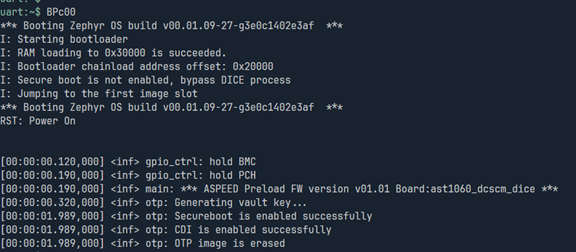

# ASPEED Preload Firmware

ASPEED preload firmware supports following features:  
- Program OTP image for writing public key to OTP
- Generate vault key by HW TRNG and write to OTP
- Enable secure boot and CDI by updating OTP
- Send device id certificate request to HSM (WIP)
- Receive, verify and store signed certificate chain to AST1060 internal flash
- Provide mailbox commands for ROT firmware replacement

Please note that all OTP operation are simulated in ast1060 internal flash.

## Bootup Flow

AST1060 should be bootup 3 times in manufactureing process

### First Bootup
In first bootup, secure boot is not enabled. Preload firmware generates vault key for CDI generation, write public key to OTP and enables secure boot.

### Second Bootup
mcuboot generate certificates, Device Firmware verifies the generated certificate and erase preload fw.  

### Third Bootup
mcuboot recovers the 1st slot firmware by customer’s firmware.

### Forth Bootup
Since 1st slot firmware is replaced from preload fw to customer’s firmware. Mcuboot regenerate alias certificate, verify and boot customer’s firmware.

