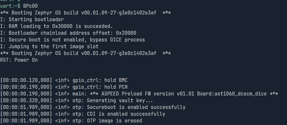
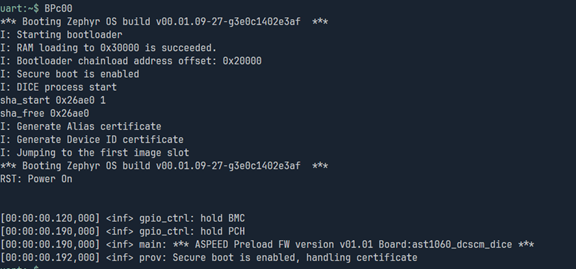
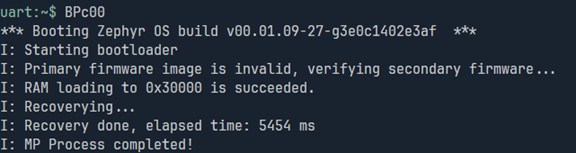
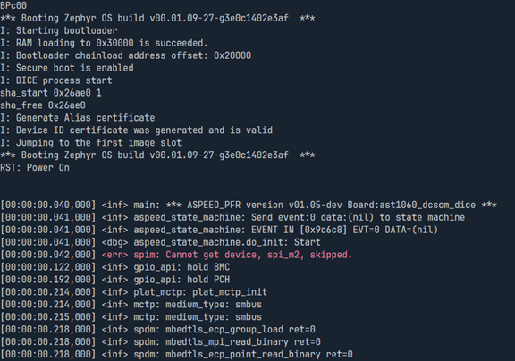

# ASPEED Preload Firmware

ASPEED preload firmware supports following features:
- Program OTP image for writing public key to OTP
- Generate vault key by HW TRNG and write to OTP
- Enable secure boot and CDI by updating OTP

## Bootup Flow

AST1060 should bootup 4 times in manufactureing process

### First Bootup
In first bootup, secure boot is not enabled. Preload firmware generates vault key for CDI generation, write public key to OTP and enables secure boot.

### Second Bootup
mcuboot generate certificates, Device Firmware verifies the generated certificate and erase preload fw.

After the second bootup, programmer should do following actions
1. Take device id CSR from ast1060 internal flash offset 0x1c000
2. send the CSR to HSM for generating certificate chain
3. Replace CSR by certificate chain in AST1060 internal flash offset 0x1c000

Please refer to PFR user guide 9.5.22 for more details.

### Third Bootup
mcuboot recovers the 1st slot firmware by customer’s firmware.

### Fourth Bootup
Since 1st slot firmware is replaced by customer’s firmware. Mcuboot regenerate alias certificate, verify and boot customer’s firmware.

